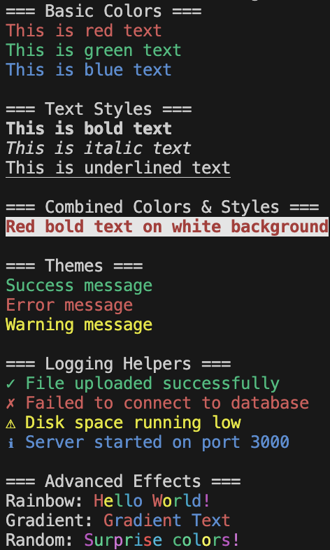

# Ink

[](https://badge.fury.io/js/@nktznl/ink)
[](https://opensource.org/licenses/MIT)
[](https://github.com/nktznl/ink/actions/workflows/ci.yml)
[](https://codecov.io/gh/nktznl/ink)

A lightweight, powerful TypeScript library for creating beautiful colorized console output with ANSI escape codes. Features chaining, themes, styles, advanced effects, and logging helpers.



## ✨ Features

- 🎨 **Color Chaining**: Chain colors and styles fluently
- 🎭 **Text Styles**: Bold, italic, underline, dim, and more
- 🎪 **Advanced Effects**: Rainbow, gradient, and random colors
- 🏷️ **Themes**: Predefined themes for success, error, warning, info
- 📝 **Logging Helpers**: Ready-to-use logging functions with icons
- 🔧 **TypeScript**: Full TypeScript support with type definitions
- 📦 **ESM & CJS**: Dual package support
- ⚡ **Zero Dependencies**: Lightweight and fast

## Installation

```bash
npm install @nktznl/ink
# or
yarn add @nktznl/ink
# or
pnpm add @nktznl/ink
```

## Usage

### Basic Colors

```js
import { ink } from '@nktznl/ink';

console.log(ink.red.text('This is red text'));
console.log(ink.green.text('This is green text'));
console.log(ink.blue.text('This is blue text'));
```

### Bright Colors

```js
console.log(ink.brightRed.text('This is bright red text'));
console.log(ink.brightGreen.text('This is bright green text'));
console.log(ink.brightBlue.text('This is bright blue text'));
```

### Background Colors

```js
console.log(ink.bgRed.text('This is text with a red background'));
console.log(ink.bgGreen.text('This is text with a green background'));
console.log(ink.bgBlue.text('This is text with a blue background'));
```

### Text Styles

```js
console.log(ink.bold.text('This is bold text'));
console.log(ink.italic.text('This is italic text'));
console.log(ink.underline.text('This is underlined text'));
console.log(ink.dim.text('This is dim text'));
```

### Combining Colors and Styles

```js
console.log(ink.red.bold.bgWhite.text('Red bold text on white background'));
console.log(ink.brightGreen.underline.text('Bright green underlined text'));
```

### Themes

```js
import { themes } from '@nktznl/ink';

console.log(themes.success.text('Operation completed successfully!'));
console.log(themes.error.text('An error occurred!'));
console.log(themes.warning.text('This is a warning'));
console.log(themes.info.text('Information message'));
```

### Logging Helpers

```js
import { log } from '@nktznl/ink';

log.success('File uploaded successfully');
log.error('Failed to connect to database');
log.warning('Disk space running low');
log.info('Server started on port 3000');
log.debug('Processing user request');
log.trace('Function called with args: x=1, y=2');
```

### Advanced Effects

```js
import { effects } from '@nktznl/ink';

// Rainbow text
console.log(effects.rainbow('Hello World!'));

// Gradient effect
console.log(effects.gradient('Gradient Text', 'red', 'blue'));

// Random colors
console.log(effects.random('Surprise colors!'));
```

## API Reference

### `ink`

The main chaining API for colors and styles.

**Available Colors:**
- Basic: `red`, `green`, `yellow`, `blue`, `magenta`, `cyan`, `white`, `black`
- Bright: `brightRed`, `brightGreen`, `brightYellow`, `brightBlue`, `brightMagenta`, `brightCyan`, `brightWhite`, `brightBlack`
- Background: `bgRed`, `bgGreen`, `bgYellow`, `bgBlue`, `bgMagenta`, `bgCyan`, `bgWhite`, `bgBlack`
- Bright Background: `bgBrightRed`, `bgBrightGreen`, `bgBrightYellow`, `bgBrightBlue`, `bgBrightMagenta`, `bgBrightCyan`, `bgBrightWhite`, `bgBrightBlack`

**Available Styles:**
- `bold`, `dim`, `italic`, `underline`, `blink`, `reverse`, `hidden`, `strikethrough`

**Methods:**
- `.text(string)`: Apply the chained colors/styles to text

### `themes`

Predefined color themes.

- `themes.success`: Green color
- `themes.error`: Red color
- `themes.warning`: Yellow color
- `themes.info`: Blue color
- `themes.debug`: Cyan color
- `themes.trace`: Magenta color

### `log`

Logging helpers with icons.

- `log.success(message)`: ✓ Success message (green)
- `log.error(message)`: ✗ Error message (red)
- `log.warning(message)`: ⚠ Warning message (yellow)
- `log.info(message)`: ℹ Info message (blue)
- `log.debug(message)`: 🔍 Debug message (cyan)
- `log.trace(message)`: 🔗 Trace message (magenta)

### `effects`

Advanced color effects.

- `effects.rainbow(text)`: Apply rainbow colors to each character
- `effects.gradient(text, startColor, endColor)`: Create gradient between two colors
- `effects.random(text)`: Apply random colors to each character

## Examples

Check out the `example/` directory for more usage examples.

## Contributing

Contributions are welcome! Please:

1. Fork the repository
2. Create a feature branch
3. Make your changes
4. Add tests for new features
5. Ensure all tests pass
6. Submit a pull request

## Development

```bash
# Install dependencies
npm install

# Run tests
npm test

# Run linter
npm run lint

# Format code
npm run format

# Build
npm run build

# Run coverage
npm run coverage
```

## License

MIT © Nikita Zanella

## Changelog

See [CHANGELOG.md](CHANGELOG.md) for release notes.
